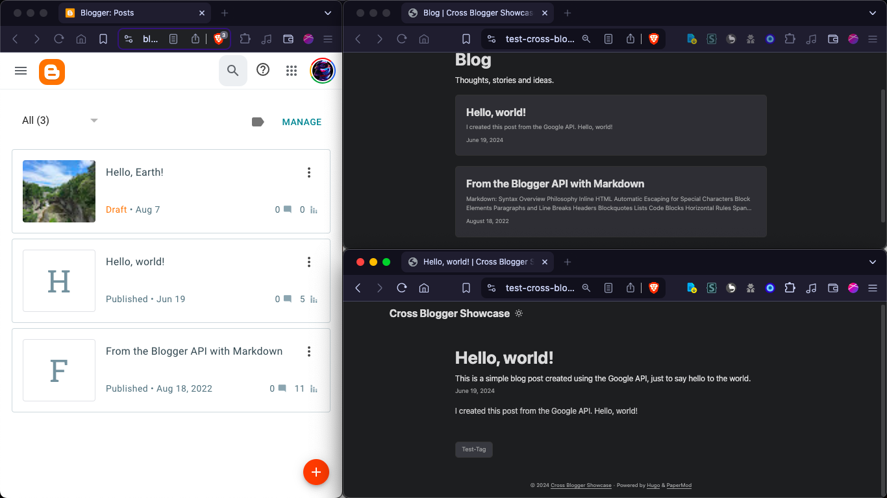

# Cross Blogger  
Headless CMS for static site generators (especially Hugo) powered by Google's Blogger.  
 
## Introduction  
The intended use case is to use the "watch" mode to watch the Blogger blog add content to a Hugo content directory. When a new post is published on Blogger (including publishing a draft), it is automatically added to the Hugo content directory and can be committed and pushed to a Git repository. Using a continuous deployment service, such as GitHub actions, the site can be automatically built and deployed with the new post.  
If enabled, posts which were added automatically can be updated or deleted from the content directory when they are deleted or unpublished on Blogger. Thus, a post can be unpublished, updated, and republished on Blogger, although this assumes that the program is given enough time to detect the unpublishing.  
[Repository](https://git.slashtechno.com/slashtechno/test-cross-blogger), on my Gitea instance, with a Hugo site showcasing posts fetched from a Blogger blog with workflows set up to automatically build and deploy the site.
### Other features  
- LLM-generated descriptions through any OpenAI-compatible API or Ollama.
  - Ollama can be used with its OpenAI-compatible API or the Ollama REST API.
- Support for categories and tags. 
  - To set these in Blogger, labels can be used. For categories, a prefix, such as `category::`, can be used to specify a category. The prefix is removed from the Blogger label and added to a `categories` array in the frontmatter. If the label does not have a prefix, it is added to a `tags` array in the frontmatter.
- Customizable frontmatter mappings for compatibility with other static site generators or specific themes.
- Customizable configuration formats (TOML, JSON, YAML, etc.) due to the use of Viper.  


### Installation  
#### Compiled Binaries  
Compiled binaries can be downloaded from Github Releases.  
#### Compile locally  
To compile this program, run `go build` inside the project root after cloning the repository.  
#### `go install`  
Using `go install`, you can compile and add the program to the PATH.  
Either run `go install github.com/slashtechno/cross-blogger@latest`, follow the same process as compiling the program locally, but replace `go build` with `go install`.  

### Usage  
#### Configuration  
**`config.example.toml`** has an example configuration file with comments.
Sources and destinations should first be configured in the `config.toml` file.  
By default, `credentials.yaml` is used to store the Google OAuth credentials and `config.toml` is used to store the configuration. These will be generated with placeholders/defaults if they do not exist. You can specify both the path to the credentials file and the path to the config file using the `--credentials-file` and `--config` flags. The file extension will dictate the format of the file. Command-line flags can also be used in some cases. Environment variables can be used for credentials and the log level although they should be prefixed with `CROSS_BLOGGER_`. If credentials are not provided through the credentials file **and the refresh token is not passed**, the credentials will be written to the credentials file as a byproduct of the refresh token being stored. It's always possible to just pass the refresh token, once obtained, some other way to prevent the credentials from being written.  
Docker can be used by placing configuration files in `config/` and running `docker compose up -d` (`-d` runs the services in the background). Edit the `docker-compose.yml` file to allow the program to access any directories you want to use, such as the directory where markdown files should be created.
#### Watching a source  
Currently, the only source is Blogger. To watch a Blogger blog, run `cross-blogger publish watch blogger <Blogger URL> <destination>`. Multiple destinations can be set by separating them with spaces. The Blogger URL should be the URL of the blog, not a specific post. The destination should be the name of the destination specified in the config file.  
When watching a source, the program will fetch posts every 30 seconds. This can be changed with the `--interval` flag (or in the config file). The interval should be any duration parsable by Go's `time.ParseDuration` function, such as `30s`, `1m`, or `1h30m`.  
Running with Docker is recommended for watching a source as it allows it to easily be run in the background and start on boot.
You can commit and push the changes to a Git repository by setting `git_dir` in the destination configuration.  

#### Help Output  
From `cross-blogger publish --help`:    
```text
Publish to a destination from a source. 
        Specify the source with the first positional argument.
        The second positional argument is the specifier, such as a Blogger post URL or a file path.
        All arguments after the first are treated as destinations.
        Destinations should be the name of the destinations specified in the config file 

Usage:
  cross-blogger publish [flags]
  cross-blogger publish [command]

Available Commands:
  watch       Act as a headless CMS of sorts by watching a source for new content and publishing it to configured destinations.

Flags:
      --dry-run                       Dry run - don't actually push the data
      --google-client-id string       Google OAuth client ID
      --google-client-secret string   Google OAuth client secret
      --google-refresh-token string   Google OAuth refresh token
  -h, --help                          help for publish
      --llm-api-key string            OpenAI API key
      --llm-base-url string           Base URL
      --llm-model string              LLM model to use for OpenAI-compatible platforms   
      --llm-provider string           LLM platform ("openai" or "ollama")

Global Flags:
      --config string             config file path (default "config.toml")
      --credentials-file string   credentials file path (default "credentials.yaml")     
      --log-level string          Set the log level

Use "cross-blogger publish [command] --help" for more information about a command. 
```  
From `cross-blogger publish watch --help`:  
```text
Act as a headless CMS of sorts by watching a source for new content and publishing it to configured destinations.
        Specify the source with the first positional argument.
        The second positional argument and on are treated as destination names.
        Ensure that these are configured in the config file.

Usage:
  cross-blogger publish watch [flags]

Flags:
  -h, --help              help for watch
  -i, --interval string   Interval to check for new content (default "30s")

Global Flags:
      --config string                 config file path (default "config.toml")
      --credentials-file string       credentials file path (default "credentials.yaml") 
      --dry-run                       Dry run - don't actually push the data
      --google-client-id string       Google OAuth client ID
      --google-client-secret string   Google OAuth client secret
      --google-refresh-token string   Google OAuth refresh token
      --llm-api-key string            OpenAI API key
      --llm-base-url string           Base URL
      --llm-model string              LLM model to use for OpenAI-compatible platforms   
      --llm-provider string           LLM platform ("openai" or "ollama")
      --log-level string              Set the log level
```
